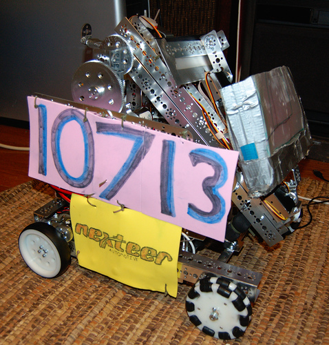
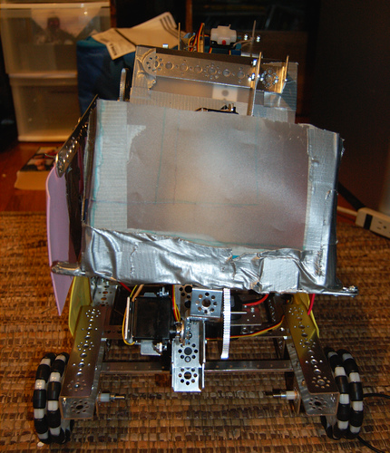

# White Pine Middle School

## FIRST Tech Challenge Team

### Team number

10713

### Coaches:

*   Jan Hlavacek
*   Blake Johnson

### Sponsors

*   Nexteer

### Pictures

#### Last year's robot

{:class="centered-image"}

{:class="centered-image"}

{:class="centered-image"}

### Visit us

on [GitHub](https://github.com/WhitepineFTC)

#### Last years code

*   The [entire FTC app](https://github.com/WhitepineFTC/2015-2016_ftc_app)

    This is a large repo, contaning all the Quallcom and FIRST code from last
    year competition.

*   If you want to see what the team did, you want to look at [this
    part](https://github.com/WhitepineFTC/2015-2016_ftc_app/tree/master/FtcRobotController/src/main/java/com/qualcomm/ftcrobotcontroller/opmodes).

